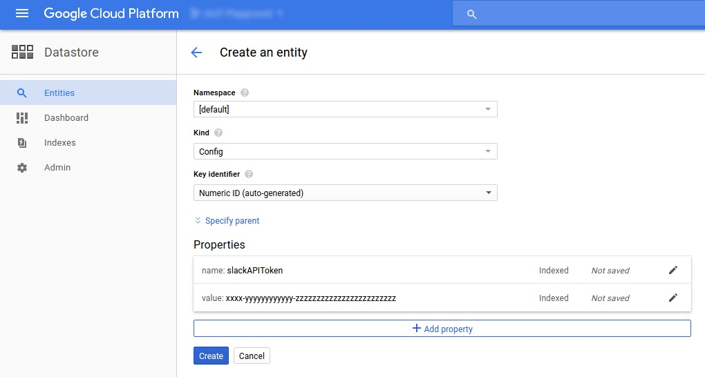
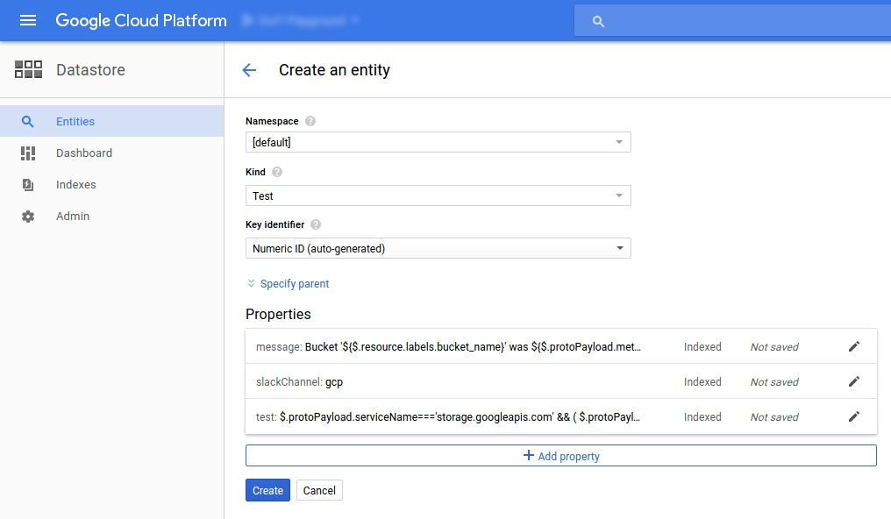

# gSlack

Many people have asked us how they might get notified by [Slack](https://slack.com/) of various events that originate within [Google Cloud Platform](https://cloud.google.com/). `Google Compute Engine` instances may start and stop, new `Google AppEngine` verions might be deployed and `Google Cloud Storage` bucket may be created or deleted. People would like to be notified of these and others via their `Slack` account.

`gSlack` allows you to install a lightweight serverless solution into your
own Google Cloud Platform project/s and easily configure the alerts you would like to receive.

## Objectives
In this tutorial you will learn how to:
- Enable `Slack` integration.
- Create `Google PubSub` a topic.
- Create `Google Stackdriver` log exports that write into the `PubSub` topic.
- Configure permissions for the log exports to be written into the `PubSub`.
- Configure and deploy a `Google CloudFunctions`(**beta**) serverless backend code to call the `Slack` API.
- Configure the alerts to notify of.

## Before you begin
This tutorial runs best when using a `*nix` operating system.

If you don't have access to a `*nix` machine you may choose to use `Google Cloud Shell` using this [quickstart](https://cloud.google.com/shell/docs/quickstart).
### Prerequisites
- You must have a `Google Cloud Platform` project with enabled billing.
- You must have access to a user with `Owner` role on the project.
- You must have `gcloud` SDK and CLI installed on your machine ([quickstart](https://cloud.google.com/sdk/docs/quickstarts)).
- You must have a `Slack` account.

**Please notice that some of the services used in this tutorial are still `beta versions` at the time of this writing and are subject to `different or no SLA`. Please consult the documentation before using this tutorial with any production critical workflow.**

### TL;DR
If you wish to skip this step-by-step tutorial - you can use the quick setup by following the [README.md](./README.md)

## Setting up your project

**Please remember to put your project ID where the text indicates so with: '`<YOUR_PROJECT_ID>`'**

Make sure your `gcloud` SDK and CLI environment is authenticated against the requested GCP project with a user that has Owner permissions.

### 1) Create a topic 
Run the following command to create a `Google Cloud PubSub` topic:
```
$ gcloud --project=<YOUR_PROJECT_ID> beta pubsub topics create gcp-alert-service
```
The command will take a few seconds to run. 
Once complete your project will contain a new topic that you can see at the [Google Cloud PubSub Console](https://console.cloud.google.com/cloudpubsub/topicList).
We will use this topic as a sink to which log exports would write our events.

### 2) Create an export sink
Run the following command to create the export sink:
```
$ gcloud --project=<YOUR_PROJECT_ID> beta logging sinks create gcp_alert_service pubsub.googleapis.com/projects/<YOUR_PROJECT_ID>/topics/gcp-alert-service --log-filter "logName=projects/<YOUR_PROJECT_ID>/logs/cloudaudit.googleapis.com%2Factivity"
```

This command creates a log export that uses the specified filter to send all `Cloud Audit Logging` activity events into the topic we created before.

You can see the new export sink at the [Log Exports Console](https://console.cloud.google.com/logs/exports).
Notice the warning icon attached to it.

As part of creating the export sink - a new service account was created. This service account is used to publish event into our topic.
However this service account still lacks the permissions required to publish into `Google PubSub`.

### 3) Granting service account permissions
Run the following command:
```
$ gcloud --project=<YOUR_PROJECT_ID> projects add-iam-policy-binding <YOUR_PROJECT_ID> --member=$(gcloud --project <YOUR_PROJECT_ID> --format="value(writer_identity)" beta logging sinks describe gcp_alert_service) --role='roles/pubsub.publisher'
```
This command grants a `pubsub.publisher` role to the service account that was created previously.
A few minutes after this command finishes you should see the warning icon removed from the export sink in the [Log Exports Console](https://console.cloud.google.com/logs/exports).

## Deploying the code
At this stage we have a export log that pushes all audit events into the topic we created.
To complete the application we need some code to recieve these events, filter them and use the `Slack` API to post messages on the desired `Slack` channel.
One way to do so that uses a fully manaaged, auoscalable, serveless comupting service is by using [Google CloudFunctions](https://cloud.google.com/functions/).
This service will deploy and scale our code as much as required for optmial performance.

`Google CloudFunctions` use [Node.js](https://nodejs.org/en/) as a runtime platform which means our code will be written using Javascript.

Before we can make a `Google CloudFunctions` deployment we must create a `Google Cloud Storage` bucket for staging and enable the `Google CloudFunctions API` for our project.

### 1) Create a staging bucket
Run the following command:
```
$ gsutil mb -p <YOUR_PROJECT_ID> gs://<YOUR_PROJECT_ID>-gcp-alert-service
```
This command will create a new bucket for our deployment to stage in.

### 2) Enable `Google CloudFunction API`
Run the following command:
```
$ gcloud --project=<YOUR_PROJECT_ID> beta service-management enable cloudfunctions.googleapis.com
```
This command might take a few minutes. After it completes the `Google CloudFunctions` API will be enabled for your project.

### 3) Writing the code
To deploy into `Google CloudFunctions` we will use two files:
- A `package.json` file that describes the module, dependencies etc'
- An `index.js` file that exports the code to be run.

### 4) Create a `package.json` file
Create a file named `package.json`, copy the content from [this link](./package.json) into the file and save it locally.

### 5) Create an `index.js` file
Create a file named `index.js`, copy the content from [this link](./index.js) into the file and save it locally.

### 6) Deploy the code
Run the following command:
```
$ gcloud --project=<YOUR_PROJECT_ID> beta functions deploy gcp-alert-service --stage-bucket <YOUR_PROJECT_ID>-gcp-alert-service --trigger-topic gcp-alert-service --entry-point=pubsubLogSink --region=us-central1
```
This command will take a few minutes. 
When complete you will can see the deployed function [here](https://console.cloud.google.com/functions/list).

## Configuration
Altough the code is deployed and events are being pushed - you will not yet recieve any `Slack` notifications. For that to happen the application must be configured.

The application code deployed in the previous section uses [Google Cloud Datastore](https://cloud.google.com/datastore) to store configuration.
`Google Cloud Datastore` is a fully managed, auto-scaling, serverless no-sql database. It allows fast updates and fetches as well as some degree of query support.

The application needs to have a `Slack API Token` configuration to allow it positn new messages to a channel.

You will also need to define the alerts you wish to be notified of.

### 1) Configuration console
Open the [Google Cloud Datastore Console](https://console.cloud.google.com/datastore) in your favorite browser.

### 2) Generate a `Slack API Token`
- Go to [https://<YOUR_SLACK_TEAM>.slack.com/apps/new/A0F7YS25R-bots]()
- Enter a name for the bot to post with. (i.e. gcp-alert-service)
- Click `Add bot integration`.
- Wait until the UI displays the `API Token` and copy the string (i.e. xxxx-yyyyyyyyyyyy-zzzzzzzzzzzzzzzzzzzzzzzz)
### 3) Configure the `Slack API Token`
- Go back to the [Google Cloud Datastore Console](https://console.cloud.google.com/datastore) page.
- Click `Create Entity`
- Enter `Config` into the `Kind` textbox.
- Add a property with a `Name` of '`name`' and `Value` of '`slackAPIToken`'. (Leave the `Type` as `String`)
- Add another property with a `Name` of '`value`' and set the `Value` to the `Slack API Token` you generated in the previous step. (Leave the `Type` as `String`)
- The result should look like this:

- Click `Create`.

### 4) Configure an alert
- Click `Create Entity`
- Enter `Test` into the `Kind` textbox.
- Add a property with a `Name` of '`message`' and set the `Value` to the following (Leave the `Type` as `String`):
```
Bucket '${$.resource.labels.bucket_name}' was ${$.protoPayload.methodName==='storage.buckets.create'?'created':'deleted'} at location '${$.resource.labels.location}' with storage class '${$.resource.labels.storage_class}' by '${$.protoPayload.authenticationInfo.principalEmail}' in project '${$.resource.labels.project_id}'
```
- Add a property with a `Name` of '`test`' and set the `Value` to the following (Leave the `Type` as `String`):
```
$.protoPayload.serviceName==='storage.googleapis.com' && ( $.protoPayload.methodName==='storage.buckets.create' || $.protoPayload.methodName==='storage.buckets.delete')
```
- Finally add a property with a `Name` of '`slackChannel`' and set the `Value` to '`gcp`'. (Leave the `Type` as `String`)
- The result should look like this:

- Click `Create`.
- You can add more alerts by repeating step 4. See the [README](./README.md) for more examples.
- After saving the configuration you should see slack messages being sent into a `Slack` channel named `gcp`. **Please make sure this channel exist and if not - create it.**
## Cleaning up
1) Go to [Google Cloud Logging Export Console](https://console.cloud.google.com/logs/exports)
1) Select the sinks created in this tutorial.
1) Click `Delete` and confirm in the popup.
1) Go to [Google PubSub Console](https://console.cloud.google.com/cloudpubsub/topicList)
1) Select the topic create in this tutorial.
1) Click `Delete` and confirm in the popup.
1) Go to [Google CloudFunctions Console](https://console.cloud.google.com/functions/list)
1) Select the function deployed in this tutorial.
1) Click `Delete` and confirm in the popup.
1) Go to [Google Cloud Storage Console](https://console.cloud.google.com/storage/browser)
1) Select the bucket created in this tutorial.
1) Click `Delete` and confirm in the popup.
1) Go to [Google Cloud Datastore Console](https://console.cloud.google.com/datastore)
1) Select all entities created in this tutorial.
1) Click `Delete` and confirm in the popup.
